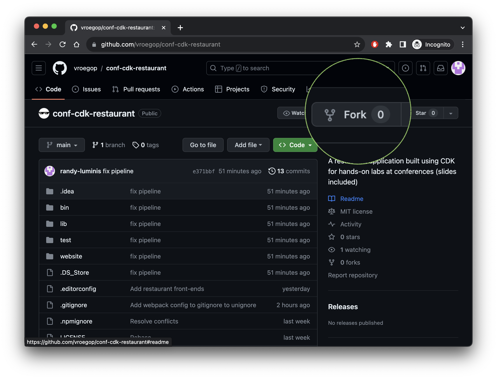
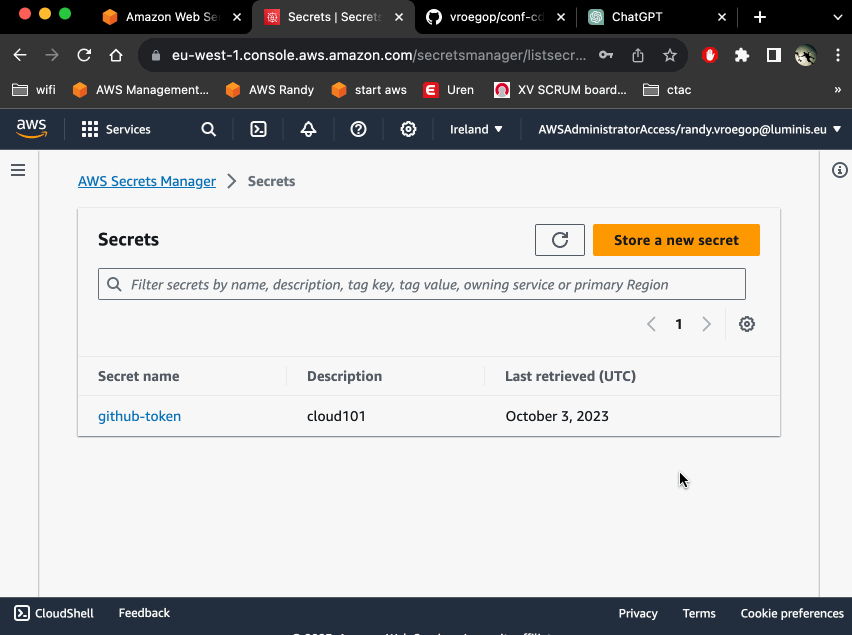
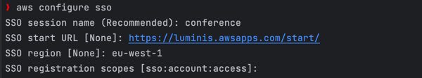
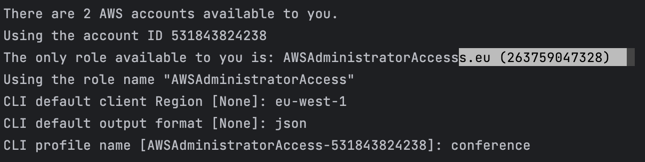
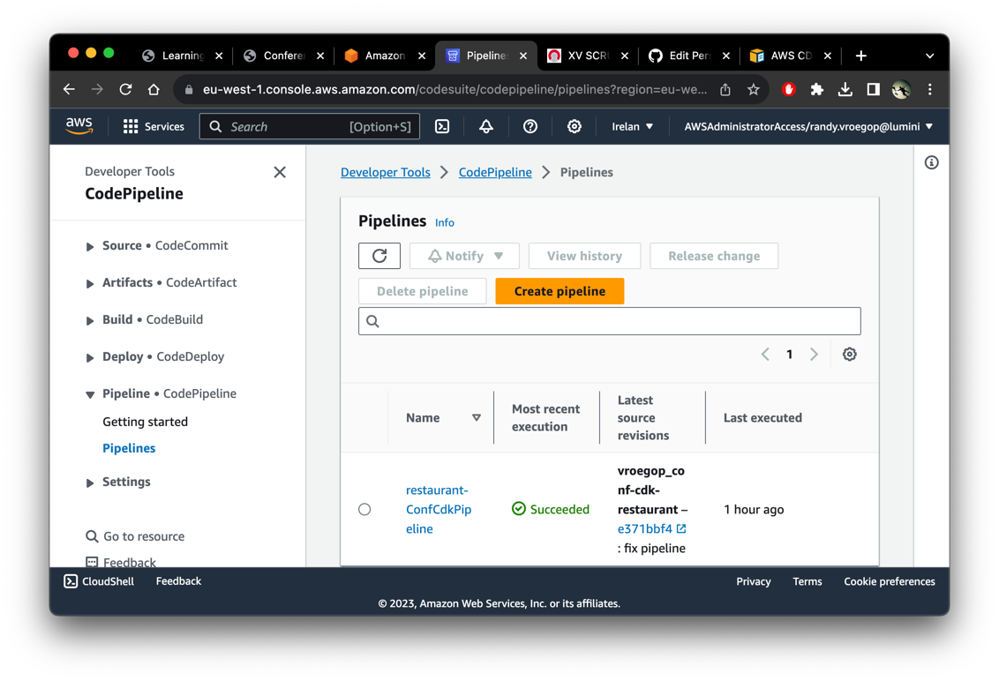

# Welcome to your CDK TypeScript project

The `cdk.json` file tells the CDK Toolkit how to execute your app.

## Useful commands

* `npm run build`   compile typescript to js
* `npm run test`    perform the jest unit tests
* `npm run serve`   serve the restaurant app for local development
* `cdk deploy`      deploy this stack to your default AWS account/region
* `cdk diff`        compare deployed stack with current state
* `cdk synth`       emits the synthesized CloudFormation template

# Chapter 1

Hello and welcome to Chapter 1!

In this chapter we are going to do a few things:

1. Create a fork of https://github.com/vroegop/conf-cdk-restaurant
2. Create an access key in GitHub to allow AWS to create a webhook
3. Add the access key to AWS Secrets Manager
4. Edit the settings.ts file
5. Install [AWS CLI via the official website](https://docs.aws.amazon.com/cli/latest/userguide/getting-started-install.html)
6. Then install CDK (`npm install -g aws-cdk`)
7. Finally run `npm install`
8. Run a few checks: `npm run build` `npm run test`
9. Create an AWS SSO profile: `aws configure sso`
10. Log in `aws sso login --profile {yourprofile}`
11. Bootstrap your profile `cdk bootstrap --profile {yourprofile}`
12. Deploy your pipeline to AWS `cdk deploy --profile {yourprofile} {yourstackname}`

# How-to

1. To create a fork:

2. Create an access key in GitHub

https://github.com/settings/tokens/new

I usually check every box except deleting the repository and creating keys, not sure what the minimum requirements are.

3. Add the key to AWS Secrets Manager

* Go to AWS Secrets Manager
* Click Store a new secret
* Choose 'Other type'
* The key must be github-token (AWS CodePipeline will recognize the token automatically that way)
* The value must be the contents of your secret token

4. Edit the settins.ts file and set the properties correctly

5. Install [AWS CLI via the official website](https://docs.aws.amazon.com/cli/latest/userguide/getting-started-install.html)

 I'm lazy, follow their guide.

6. Install CDK CLI via NPM

Maybe you need to install node.js first.

> `npm i -g aws-cdk`

7. Run `npm install` in the directory of your fork (which you cloned to your machine)

8. Run a few checks: `npm run build`, `npm run test`

9. Configure the AWS SSO

* Tick some 'allow' boxes in your browser that opened automatically
* Then in the console, select the AWS account of the sandbox if required

10. Log in `aws sso login --profile {yourprofile}`

In my example the profile name would be 'conference' so the command 

> `aws sso login --profile conference`

11. Bootstrap your pipeline to AWS

This step is required and will create an S3 bucket with your configurations

> `cdk bootstrap --profile {profile}`

12. Deploy your pipeline to AWS

> `cdk deploy --profile {profile} {yourstackname}`

* The stackname is `${subdomain}Pipeline`
* This means if you change the profile and change the subdomain to 'conference' the command would be:
> `cdk deploy --profile conference conferencePipeline`
* Deploying requires you to click yes a few times
* Check the AWS Console, CodePipeline for the status

## Succesful?!

If so, your website should be up and running!

You changed the subdomain to something else, this will be your subdomain.

> If you are on the Luminis Sandbox the url will be subdomain.cloud101.nl

> If you are on the Eleven Sandbox the url will be subdomain.cloud111.nl
