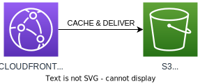
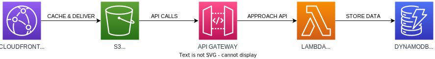

# Chapter 2

You are now in chapter 2.

Your first task: make sure `/settings.ts` contains **EXACTLY** the same
properties as in the previous chapter. This makes sure no duplicate stacks
are created.

# Current status

# What is the plan

# What do I do?

The solution is available in the 'chapter-3' branch if you want to have the solution as an example.

In IntelliJ, to compare your current branch to the desired one, right-click in a file and go to git -> compare with branch

Search everywhere for 'todo:' to find out what to implement.

Note: Code for lambda is provided, your job is to create the CDK Constructs.

1. Add an API, Lambda, Certificate and DynamoDB database table to the file `conf-cdk-restaurant-api-stack.ts`
2. Export the API
3. In the `conf-cdk-pipeline-stack.ts` file, add the stack to the build
4. Add the API as a parameter for the frontend-stack to point the distribution to the API
  * You will need to change both the frontend-stack and pipeline-stack files for this, add it as a constructor parameter and actually provide it too
5. In the frontend-stack, add additionalBehaviors to the distribution and point it to the API